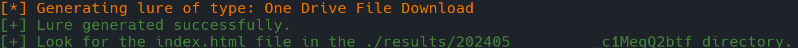
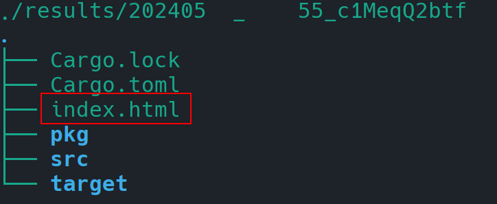

# W.A.L.K. - Web Assembly Lure Krafter
A web assembly (WASM) lure generator based on custom lure templates and written in Rust to aid with initial access leveraging WASM smuggling techniques. 

<p align="center">
  
</p>

# Table of Contents

- [WASM](#wasm)
- [W.A.L.K. - Web Assembly Lure Krafter](#walk---web-assembly-lure-krafter)
- [What, Why?](#what-why)
- [Setup](#setup)
  - [Install Rust](#install-rust)
  - [Install `wasm-pack` and `wasm-bindgen-cli`](#install-wasm-pack-and-wasm-bindgen-cli)
  - [Clone, Build and Run W.A.L.K.](#clone-build-and-run-walk)
- [Use](#use)
- [Lure Templates](#lure-templates)
  - [Google Chrome Update](#google-chrome-update)
  - [One Drive File Download](#one-drive-file-download)
  - [Sample](#sample)
- [Modularity](#modularity)
- [Credits](#credits)
- [Disclaimer](#disclaimer)
- [License](#license)

# What, Why?


This is the tool I developed off the back of the recent research I’ve done into crafting web smuggling lures using web assembly. You can read the accompanying blogpost "[WASM Smuggling for Initial Access and W.A.L.K. Tool Release](https://labs.jumpsec.com/wasm-smuggling-for-initial-access-and-w-a-l-k-tool-release/)" on [JUMPSEC Labs](https://labs.jumpsec.com/).

# Setup


## Install Rust

[Install Rust](https://www.rust-lang.org/tools/install)

```bash
curl --proto '=https' --tlsv1.2 -sSf https://sh.rustup.rs | sh

# source the corresponding env file under $HOME/.cargo
. "$HOME/.cargo/env"   
```

## Install `wasm-pack` and `wasm-bindgen-cli`

```bash
cargo install -f wasm-pack wasm-bindgen-cli

# add cargo to path
# zshrc
echo 'export PATH=$HOME/.cargo/bin:$PATH' >> ~/.zshrc
# bashrc
echo 'export PATH=$HOME/.cargo/bin:$PATH' >> ~/.bashrc

```

> 🚧 **For Arch / Manjaro  users**
> 
> Install base-devel dependency first
> `sudo pacman -Syu && sudo pacman -S base-devel`


**Open New Terminal or use Source command to enable wasm-pack binary path**

```bash
# replace with zshrc if you are using zsh
source ~/.bashrc
```

## Clone, Build and Run W.A.L.K.

```bash
git clone https://github.com/JumpsecLabs/WALK_WebAssembly_Lure_Krafter.git
cd WALK_WebAssembly_Lure_Krafter
```

From the project's root folder run:

```bash
cargo run
```

# Use


The Web Assembly Lure Krafter is quite straightforward to use. Just execute `cargo run` from the project’s folder. The tool will ask you to select a lure to generate.
<p align="center">
  
</p>
Select the lure template you want to use, then the tool will ask you to enter the following:

- Select the lure to generate.
- Enter the payload’s extension. This can be anything but should match the extension of your payload.
- Enter the absolute file path of the payload to smuggle.
- Enter the payload name (without the extension at the end).

The tool will then compile and generate a lure based on the template selected and embed the payload file you provided the path for.
<p align="center">
  
</p>
Each lure that W.A.L.K. generates is stored in a sub-directory of the `results/` directory, presenting a timestamp and a random string in the name. The generated lure will consist in a single `index.html` file stored in its timestamped sub-directory contained in `results/`. The `index.html` is the only file you will need as it contains the Web Assembly lure and the payload embedded within it. 

<p align="center">
  
</p>
This file can be sent over email or chat without triggering anti-virus scans or security measures, effectively flying under the radar at the time of writing. To the end-user is left the arduous task to determine the best way to share their lures. 

# Lure Templates

W.A.L.K. comes pre-packed with some lures, namely:

- Google Chrome Update
- One Drive File Download
- Sample

However, as described next, it is possible to add extra lure templates to the tool and use them in your engagement. At the moment, these are the lure I developed for the tool:

## Google Chrome Update

This lure was designed to simulate a Google Chrome browser update request from an I.T. department. The payload download is triggered when the “Update Chrome” button is clicked. 


## One Drive File Download

This web assembly lure was designed to simulate a OneDrive file download. The lure presents the screen shown below and sleeps for `4 seconds` before automatically downloading the payload.


## Sample

It’s just a sample web page with no contents that automatically downloads the payloads you embedded in it. 

# Modularity

W.A.L.K. was designed to be modular and be able to create new lures based on template files located in `lure_templates/` . By adding more lures in the `lure_templates/` directory it is possible to then call the template from the tool’s  menu by adding an entry to it in `src/main.rs`.

Once you add a `.rs` template file in `lure_templates/`, modify the `src/main.rs` file’s menu by adding an entry for the new template in `fn main()`:

<p align="center">
  
</p>
The menu entry will trigger the searching for the relevant file using the following logic. 
<p align="center">
  
</p>
This means that if you add a menu entry such as "New Lure" and then select it from the menu, W.A.L.K. will go look for a file names "new_lure.rs" file inside the `lure_templates/` directory.
For example, when selecting the “Google Chrome Update” lure from the menu, W.A.L.K. will look for `google_chrome_update.rs` in the `lure_templates/` directory.

# Credits

Many thanks to David Kennedy for beta-testing the tool.

Thanks to NETSPI’s research into WASM smuggling and their tool silkwasm:
[The Silk Wasm: Obfuscating HTML Smuggling with Web Assembly](https://www.netspi.com/blog/technical-blog/adversary-simulation/obfuscating-html-smuggling-with-web-assembly/)
[GitHub - NetSPI/silkwasm: HTML Smuggling with Web Assembly](https://github.com/NetSPI/silkwasm/tree/main)

A shoutout to researchers at delivr.to who have released an amazing article explaining how to build WASM lures in Rust:
[WebAssembly Smuggling: It WASM’t me](https://blog.delivr.to/webassembly-smuggling-it-wasmt-me-648a62547ff4)

# Disclaimer

The tools and software provided in this repository by JUMPSEC are intended for educational and lawful purposes only. JUMPSEC is in no way, shape, or form responsible for any misuse or unintended use of these tool. Users are solely responsible for ensuring that their use of the tool complies with all applicable laws and regulations.

JUMPSEC does not condone or support any activities that may cause harm, damage, or unauthorized access to systems, data, or networks. Any malicious or unauthorized use of the tools provided in this repository is strictly prohibited. Users should obtain proper authorisation before engaging in any security testing activities.

By using the tools in this repository, you acknowledge that JUMPSEC shall not be held liable for any damages, legal consequences, or other repercussions that may arise from the misuse of these tools.

# License

GNU General Public License v3.0


