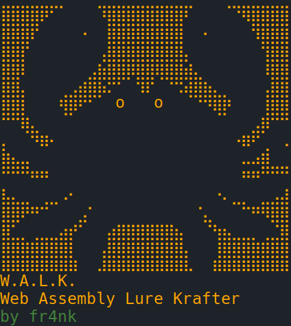
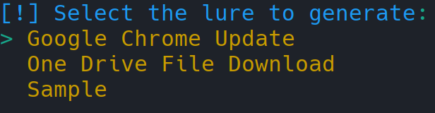
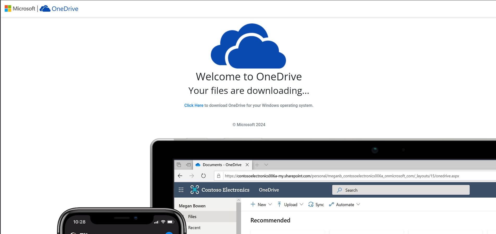

# W.A.L.K. - Web Assembly Lure Krafter
A web assembly (WASM) lure generator based on custom lure templates and written in Rust with some GenAI assistance. 



# What, Why?


This is the tool I developed off the back of the recent research I’ve done into crafting web smuggling lures using web assembly.

# Setup


## Install Rust

[Install Rust](https://www.rust-lang.org/tools/install)

```bash
curl --proto '=https' --tlsv1.2 -sSf https://sh.rustup.rs | sh
```

## Install `wasm-pack` and `wasm-bindgen-cli`

```bash
cargo install -f wasm-pack wasm-bindgen-cli

# add cargo to path
# zshrc
echo 'export PATH=$HOME/.cargo/bin:$PATH' >> ~/.zshrc
# bashrc
echo 'export PATH=$HOME/.cargo/bin:$PATH' >> ~/.bashrc

```

**Open New Terminal or use Source command to enable wasm-pack binary path**

```bash
# replace with zshrc if you are using zsh
source ~/.bashrc
```

## Build and Run W.A.L.K.

From the project's folder run:

```bash
cargo run
```

# Use


To use Web Assembly Lure Krafter is very easy. Just execute `cargo run` from the project’s folder. The tool will ask you to select a lure to generate.



Select the lure template you want to use, then the tool will ask you to enter the following:

- Select the lure to generate.
- Enter the payload’s extension. This can be anything.
- Enter the absolute file path of the payload to smuggle.
- Enter the payload name (without the extension at the end).

The tool will then compile and generate a lure based on the template selected and embed the file you provided the path for.


# Lure Templates


W.A.L.K. comes pre-packed with some lures, namely:

- Google Chrome Update
- One Drive File Download
- Sample

However, as described next, it is possible to add extra lure templates to the tool and use them in your engagement. At the moment, these are the lure I developed for the tool:

## Google Chrome Update

This lure was designed to simulate a Google Chrome update request from the I.T. department. The payload download is triggered when the “Update Chrome” button is clicked. 


## One Drive File Download

This web assembly lure was designed to simulate a OneDrive file download. The lure presents the screen shown below and sleeps for `4 seconds` before automatically downloading the payload.



## Sample

It’s just a sample web page with no contents that automatically downloads the payloads you embedded in it. 

# Modularity


W.A.L.K. was designed to be modular and be able to create new lures based on template files located in `lure_templates/` . By adding more lures in the `lure_templates/` directory it is possible to then call the template from the tool’s  menu by adding an entry to it in `src/main.rs`.

Once you add a `.rs` template file in `lure_templates/`, modify the `src/main.rs` file’s menu by adding an entry for the new template in `fn main()`:


The menu entry will trigger the searching for the relevant file using the following logic. 


This means that if you add a menu entry such as "New Lure" and then select it from the menu, W.A.L.K. will go look for a file names "new_lure.rs" file inside the `lure_templates/` directory.
For example, when selecting the “Google Chrome Update” lure from the menu, W.A.L.K. will look for `google_chrome_update.rs` in the `lure_templates/` directory.

# Acknowledgements


Many thanks to David Kennedy for beta-testing this and reported some bugs that needed fixing.

# Similar Tools


NETSPI’s silkwasm

[GitHub - NetSPI/silkwasm: HTML Smuggling with Web Assembly](https://github.com/NetSPI/silkwasm/tree/main)
